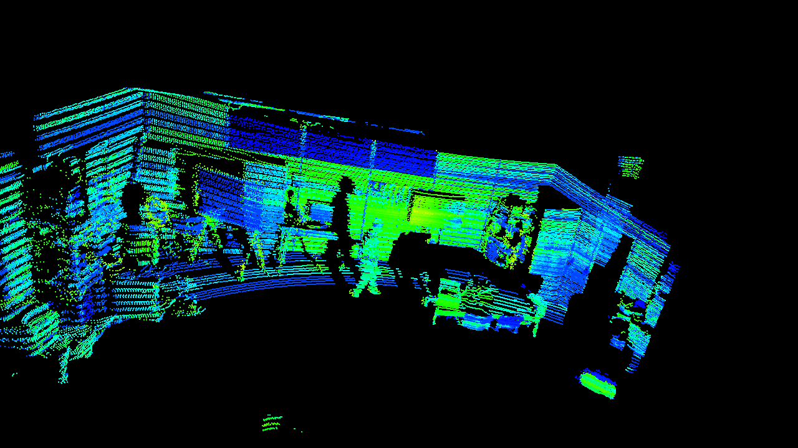
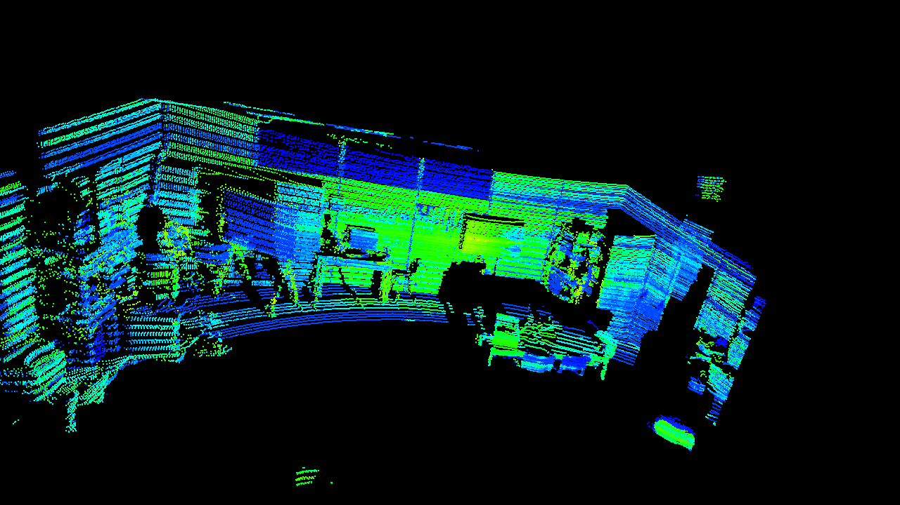
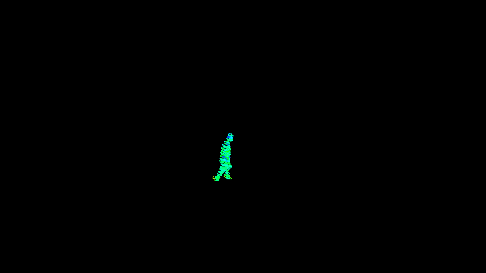

# LiDAR Point Cloud Processing and Background Subtraction

Python scripts for processing, visualizing, and extracting foreground objects from LiDAR point-cloud sequences using [Open3D](https://www.open3d.org/).

The repository implements a simple LiDAR processing workflow for:

* loading and visualizing `.pcd` point clouds;
* converting LiDAR CSV data into Open3D point clouds;
* reconstructing acquisition timing from filenames and timestamps;
* visualizing point-cloud sequences;
* subtracting a static reference background;
* filtering foreground noise;
* optionally isolating the dominant foreground object using DBSCAN;
* projecting foreground point clouds into 2D depth maps;
* saving processed foreground sequences as `.pcd` files;
* storing depth-map sequences as NumPy arrays.

The current implementation uses the **Open3D legacy geometry API** (`open3d.geometry.PointCloud`).

---

## Repository Structure
'''
.
├── functions.py
├── main.py
├── main_background_sub.py
├── main_background_sub_sequence.py
├── README.md
└── background_subtraction_images/
    ├── 01_scene.png
    ├── 02_background.png
    ├── 03_foreground.png
    └── 04_foreground_filtered.png
'''

### `functions.py`

Contains the reusable point-cloud processing functions used by the other scripts.

Main functionality includes:

* CSV-to-point-cloud conversion;
* point-cloud sequence visualization;
* timestamp extraction;
* frame-rate estimation support;
* foreground extraction using static-background subtraction;
* statistical outlier removal;
* optional DBSCAN clustering;
* 3D point-cloud to 2D depth-map projection;
* batch foreground extraction and PCD export.

### `main.py`

Loads a sequence of PCD files and visualizes them as a LiDAR recording.

The acquisition timestamps are extracted from the filenames, and the approximate frame rate is calculated from the median sampling interval.

### `main_background_sub.py`

Single-frame demonstration of the complete background-subtraction pipeline.

It visualizes the intermediate processing stages:

```text
Scene
  ↓
Reference background
  ↓
Voxel downsampling
  ↓
Background subtraction
  ↓
Statistical outlier removal
  ↓
DBSCAN clustering
  ↓
Extracted person / foreground object
```

This script is useful for visually inspecting the algorithm and tuning its parameters.

### `main_background_sub_sequence.py`

Extends foreground extraction to a sequence of LiDAR frames.

The script supports two main stages:

1. foreground extraction and storage as individual `.pcd` files;
2. projection of processed foreground clouds into 2D depth maps.

The normalized depth maps are displayed using OpenCV, while the complete depth sequence is stored as a NumPy array.

---

# Requirements

The scripts require Python and the following packages:

```text
open3d
numpy
pandas
opencv-python
```

Install them with:

```bash
pip install open3d numpy pandas opencv-python
```

Standard Python modules used by the repository include:

```text
os
glob
time
datetime
```

---

# Input Data

The repository primarily operates on LiDAR point clouds stored as:

```text
.pcd
```

CSV LiDAR measurements are also supported by `csv_to_pcd()`.

The expected CSV columns are:

```text
Timestamp_s
Timestamp_ns
Points_X
Points_Y
Points_Z
Intensity1
```

The XYZ columns define the Cartesian coordinates of each LiDAR point.

`Intensity1` is normalized to the range `[0, 1]` and assigned to the RGB channels to obtain a grayscale point-cloud representation.

---

# Point-Cloud Visualization

A sequence of PCD files can be visualized using:

```python
read_vis_pcd(pcd_files, fps)
```

The point cloud is updated inside a single Open3D visualization window rather than creating a new geometry for every frame.

A typical workflow is implemented in `main.py`:

```python
pcd_files = sorted(
    glob.glob("path/to/pointclouds/*.pcd")
)

df_info = read_files_extract_info(pcd_files)

sampling_time = np.array(
    df_info["sampling_time"],
    dtype=np.float32
)

fps = int(
    round(
        1 / np.median(np.diff(sampling_time))
    )
)

read_vis_pcd(pcd_files, fps)
```

---

# Timestamp Handling

`read_files_extract_info()` extracts acquisition information directly from the PCD filenames.

For filenames following the expected LiDAR naming convention, the function retrieves:

* frame number;
* acquisition date and time;
* relative sampling time.

The result is returned as a Pandas `DataFrame` containing:

```text
filenames
frames
datetimes
sampling_time
```

The sampling time can subsequently be used to estimate the acquisition frame rate.

> **Note:** the filename parser assumes the specific filename structure used by the current LiDAR acquisition system. It may need modification for data recorded using another naming convention.

---

# Background Subtraction

Foreground extraction is performed by comparing a scene point cloud with a reference point cloud representing the static environment.

Let

$$
\mathcal{S} =
\{\mathbf{s}_1,\mathbf{s}_2,\ldots,\mathbf{s}_N\}
$$

represent the current scene and

$$
\mathcal{B} =
\{\mathbf{b}_1,\mathbf{b}_2,\ldots,\mathbf{b}_M\}
$$

represent the static background.

For each scene point, the nearest point in the background is identified:

$$
d_i =
\min_{\mathbf{b}_j \in \mathcal{B}}
\left\|
\mathbf{s}_i-\mathbf{b}_j
\right\|_2.
$$

A scene point is classified as foreground when

$$
d_i > \tau,
$$

where \(\tau\) is the selected background-subtraction distance threshold.

Therefore,

$$
\mathbf{s}_i \in \mathcal{F}
\quad\Longleftrightarrow\quad
d_i > \tau,
$$

where \(\mathcal{F}\) denotes the foreground point set.

---

## KD-Tree Nearest-Neighbor Search

Searching every scene point against every background point directly would be computationally inefficient.

The repository therefore constructs an Open3D KD-tree:

```python
bg_tree = o3d.geometry.KDTreeFlann(background_ds)
```

For each point in the scene, its nearest background point is retrieved using:

```python
k, idx, d2 = bg_tree.search_knn_vector_3d(pt, 1)
```

The returned squared distance is converted to Euclidean distance:

```python
dist = np.sqrt(d2[0])
```

Foreground classification is then performed using:

```python
foreground_mask[i] = dist > distance_threshold
```

---

# Background-Subtraction Algorithm

```text
INPUT:
    Scene point cloud S
    Background point cloud B
    Distance threshold τ

OUTPUT:
    Foreground/person point cloud P


1. Load scene point cloud S

2. Load reference background point cloud B

3. Optionally voxel-downsample S and B

4. Construct a KD-tree from B

5. Initialize foreground set F

6. For each point s in S:

       Find the nearest background point b

       Compute:

           d = ||s - b||

       If d > τ:

           classify s as foreground

7. Apply statistical outlier removal to F

8. Optionally apply DBSCAN clustering

9. If DBSCAN is enabled:

       remove points classified as noise

       identify the largest valid cluster

       select the largest cluster as P

   Otherwise:

       P = filtered foreground

10. Return P
```

---

# Statistical Outlier Removal

Background subtraction can leave isolated measurements caused by LiDAR noise, imperfect alignment, or small differences between acquisitions.

The foreground cloud is therefore filtered using:

```python
foreground_clean, ind = foreground.remove_statistical_outlier(
    nb_neighbors=20,
    std_ratio=2.0
)
```

The implementation in `extract_person_pc()` currently uses:

```python
nb_neighbors=10
std_ratio=2.0
```

while the single-frame experimental script uses:

```python
nb_neighbors=20
std_ratio=2.0
```

These parameters can be adjusted depending on point density and sensor noise.

---

# DBSCAN Foreground Clustering

After filtering, DBSCAN can optionally separate spatially distinct foreground objects.

Example:

```python
labels = np.array(
    foreground_clean.cluster_dbscan(
        eps=0.08,
        min_points=80,
        print_progress=False
    )
)
```

DBSCAN assigns a cluster label to each point.

Points with:

```text
label = -1
```

are treated as noise.

When valid clusters are available, the current implementation selects the cluster containing the largest number of points:

```python
cluster_ids, counts = np.unique(
    valid_labels,
    return_counts=True
)

largest_cluster = cluster_ids[
    np.argmax(counts)
]
```

This assumes that the person or desired foreground object corresponds to the largest detected cluster.

---

# Foreground Extraction Function

The reusable foreground extraction function is:

```python
extract_person_pc(
    scenepath,
    backgroundpath,
    visualization=False,
    dbscan=False
)
```

Example:

```python
person = extract_person_pc(
    "scene.pcd",
    "background.pcd",
    visualization=True,
    dbscan=True
)
```

The function performs:

```text
Scene + Background
       ↓
Nearest-neighbor background comparison
       ↓
Distance threshold
       ↓
Foreground
       ↓
Statistical outlier removal
       ↓
Optional DBSCAN
       ↓
Extracted point cloud
```

---

# Important Background-Subtraction Parameters

## Distance Threshold

The most important parameter is:

```python
distance_threshold
```

The reusable `extract_person_pc()` function currently uses:

```python
distance_threshold = 0.15
```

corresponding to:

```text
15 cm
```

These are substantially different thresholds and will produce different foreground segmentation results.

A smaller threshold is more sensitive to changes in the scene but may retain additional noise.

A larger threshold rejects more background variation but can remove parts of the desired foreground object.

---

# Coordinate Alignment Requirement

The background-subtraction method assumes that the scene and reference background are represented in the **same coordinate system**.

The LiDAR sensor should therefore remain at approximately the same position and orientation between:

```text
background acquisition
```

and

```text
scene acquisition
```

Sensor displacement or rotation can cause static surfaces to appear as foreground because their coordinates will no longer match the reference background.

For acquisitions with changing sensor poses, point-cloud registration should be performed before background subtraction.

---

# Processing a Sequence

Foreground point clouds can be extracted and stored frame by frame using:

```python
extract_and_save_person_pc_sequence(
    scene_rootfolder,
    backgroundpath,
    foldersave
)
```

The resulting files follow the format:

```text
frame0.pcd
frame1.pcd
frame2.pcd
...
```

The sequence can subsequently be loaded for visualization or depth-map generation.

---

# Point Cloud to Depth Map

`pcd_to_depth_map_manual()` projects a 3D point cloud onto a 2D image using a pinhole projection model.

The default image parameters are:

```python
width = 640
height = 480

fx = 100.0
fy = 100.0
```

The principal point is calculated as:

```python
cx = (width - 1) / 2
cy = (height - 1) / 2
```

Projection is performed using:

$$
u =
f_x\frac{x}{z}+c_x
$$

and

$$
v =
f_y\frac{y}{z}+c_y.
$$

If multiple 3D points are projected onto the same image pixel, a z-buffer is used so that the nearest point is retained.

---

## Current Coordinate Mapping

The current implementation maps the input point-cloud coordinates using:

```python
x = points[:, 0]
y = -points[:, 2]
z = points[:, 1] - 3
```

This transformation is specific to the current experimental geometry.

In particular:

```python
z = points[:, 1] - 3
```

contains a fixed translation of `3` units.

This should not be interpreted as a general LiDAR-to-camera transformation. For other acquisition setups, the coordinate mapping should be replaced by a calibrated rigid transformation.

The function already supports an optional `4 × 4` extrinsic transformation matrix through:

```python
extrinsic
```

---

# Depth-Map Visualization

For each foreground point cloud, the sequence-processing script generates a depth map:

```python
persondepth = pcd_to_depth_map_manual(person)
```

Valid depths are identified using:

```python
valid_mask = depth > 0
```

The valid depth range is subsequently normalized to an 8-bit grayscale representation:

```text
0–255
```

and displayed using OpenCV:

```python
cv2.imshow("window_name", depth_norm)
```

Press:

```text
q
```

to stop the depth-map visualization.

---

# Depth Sequence Storage

The normalized depth frames are collected into an array and stored using:

```python
np.save(
    "alldepth_video.npy",
    alldepth_video
)
```

The saved NumPy file can later be loaded with:

```python
depth_video = np.load(
    "alldepth_video.npy"
)
```

> The current normalization is performed independently for each frame. Consequently, the same grayscale value does not necessarily correspond to the same physical depth in different frames.

For quantitative depth analysis, storing the original floating-point depth values before per-frame normalization is preferable.

---

# Running the Scripts

## 1. Visualize a PCD Sequence

Edit the PCD directory in:

```text
main.py
```

For example:

```python
pcd_files = sorted(
    glob.glob(
        "C:/path/to/sequence/*.pcd"
    )
)
```

Then run:

```bash
python main.py
```

---

## 2. Test Background Subtraction on One Frame

Edit the scene and reference-background paths in:

```text
main_background_sub.py
```

Then run:

```bash
python main_background_sub.py
```

Several Open3D windows will display the intermediate processing stages.

---

## 3. Process a Complete Sequence

Configure:

```python
scene_rootfolder
backgroundpath
processed_scene_folder
```

inside:

```text
main_background_sub_sequence.py
```

The first processing block, which extracts and saves foreground PCD files, is currently commented out.

Enable it when foreground point clouds need to be regenerated.

The second part loads the processed PCD frames, converts them to depth maps, displays them, and stores the resulting sequence.

Run:

```bash
python main_background_sub_sequence.py
```

---

# Typical Processing Pipeline

```text
                 LiDAR acquisition
                        │
                        ▼
                Raw PCD sequence
                        │
              ┌─────────┴─────────┐
              │                   │
              ▼                   ▼
       Scene point cloud    Static background
              │                   │
              └─────────┬─────────┘
                        │
                        ▼
                 Voxel downsampling
                        │
                        ▼
               Background KD-tree
                        │
                        ▼
           Nearest-neighbor comparison
                        │
                        ▼
              Distance thresholding
                        │
                        ▼
                Foreground points
                        │
                        ▼
          Statistical outlier removal
                        │
                        ▼
               Optional DBSCAN
                        │
                        ▼
           Extracted person/object
                        │
              ┌─────────┴─────────┐
              │                   │
              ▼                   ▼
          PCD sequence        2D projection
                                  │
                                  ▼
                              Depth maps
                                  │
                                  ▼
                          NumPy depth sequence
```


## Background Subtraction Example

The following example illustrates the main stages of the LiDAR
background-subtraction pipeline.

A static background point cloud is used as a spatial reference. For each
point in the acquired scene, the nearest point in the background is found
using a KD-tree. Scene points whose nearest-background distance exceeds the
selected threshold are retained as foreground points.

The extracted foreground is subsequently processed using statistical
outlier removal to suppress isolated measurements and residual subtraction
noise.

<table>
  <tr>
    <td align="center">
      <br>
      <b>(a) Scene point cloud</b>
    </td>
    <td align="center">
      <br>
      <b>(b) Reference background</b>
    </td>
  </tr>
  <tr>
    <td align="center">
      <br>
      <b>(c) Extracted foreground</b>
    </td>
    <td align="center">
      <br>
      <b>(d) Foreground after statistical outlier removal</b>
    </td>
  </tr>
</table>

The processing sequence shown above can be summarized as:

```text
Scene point cloud + Static background
                │
                ▼
        KD-tree construction
                │
                ▼
   Nearest-background distance
                │
                ▼
      Distance thresholding
                │
                ▼
        Raw foreground
                │
                ▼
 Statistical outlier removal
                │
                ▼
       Clean foreground

---

# Current Limitations

This repository is currently a research/prototype implementation rather than a general-purpose point-cloud processing library.

Important limitations include:

* several input paths are hard-coded;
* the filename parser assumes a specific LiDAR filename format;
* scene and background point clouds must already be spatially aligned;
* background subtraction uses a fixed nearest-neighbor distance threshold;
* different scripts currently use different foreground thresholds;
* DBSCAN parameters are fixed;
* the largest cluster is assumed to correspond to the desired subject;
* depth-map camera parameters are manually specified;
* the current LiDAR-to-image coordinate mapping is acquisition-specific;
* depth images are normalized independently for visualization;
* the current sequence script displays depth images but does not save individual PNG frames;
* processing parameters are currently defined directly inside the scripts rather than through command-line arguments or configuration files.

---

# Possible Extensions

Potential improvements include:

* automatic point-cloud registration;
* configurable processing parameters;
* command-line arguments;
* automatic foreground threshold selection;
* region-of-interest filtering;
* ground-plane removal;
* improved person-cluster selection;
* temporal tracking across consecutive frames;
* calibrated LiDAR-to-camera projection;
* saving rendered Open3D views as PNG images;
* saving individual depth-map images;
* video export;
* parameter logging for reproducible experiments;
* batch processing of multiple acquisitions.

---

# Notes

The processing pipeline assumes metric point-cloud coordinates when thresholds such as:

```python
0.03
```

or:

```python
0.15
```

are interpreted as meters.

Before applying the code to a different LiDAR sensor or dataset, verify:

1. the coordinate units;
2. the sensor coordinate convention;
3. scene/background alignment;
4. filename structure;
5. point density;
6. appropriate background-subtraction threshold;
7. appropriate outlier-removal parameters;
8. appropriate DBSCAN parameters;
9. camera intrinsics and extrinsics used for depth projection.

---

## Software

The repository is implemented in Python using:

* Open3D for 3D point-cloud processing and visualization;
* NumPy for numerical operations;
* Pandas for CSV and metadata handling;
* OpenCV for depth-map visualization.
